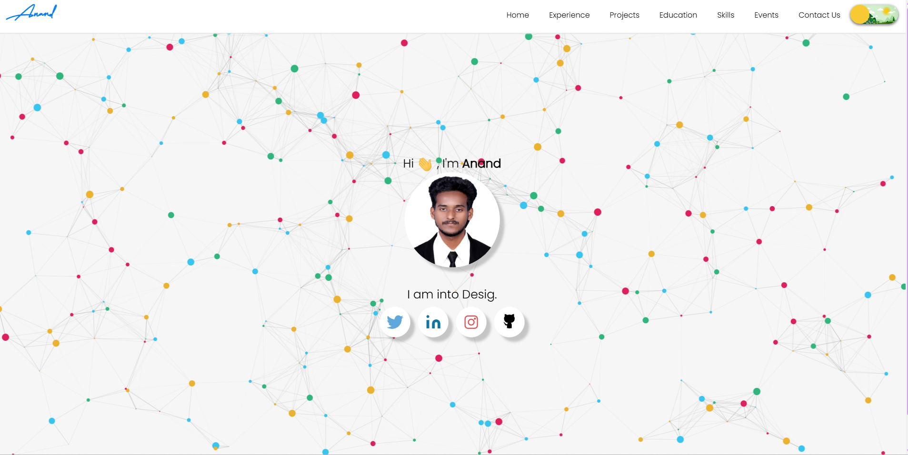
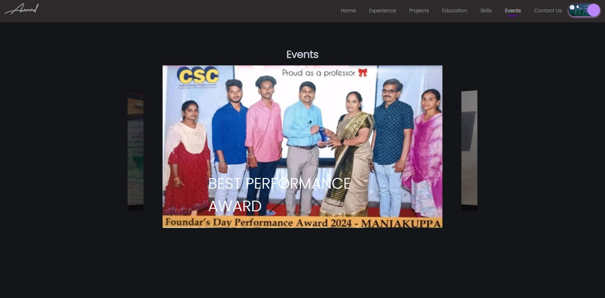
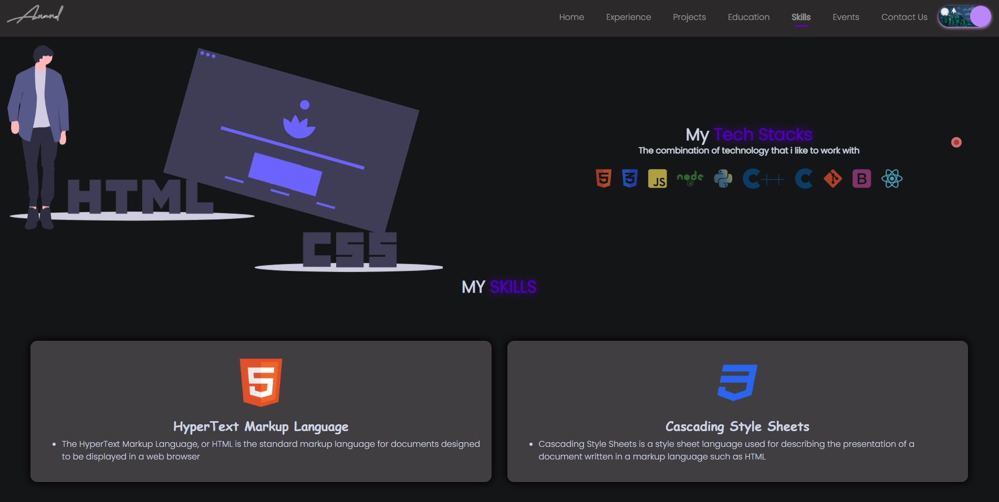
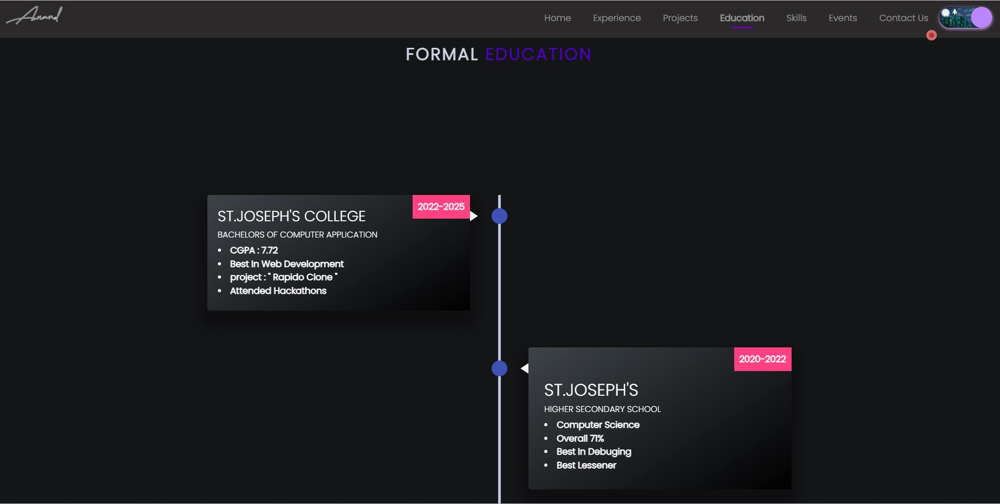

A community maintained open source project aimed at making personal portfolio for researchers, developers and analysts simple, fast and less cumbersome. We make sure you have a full-fledged website to showcase your work while you can spend time on your learning and innovative endeavours.

## A sneak peek into what we have here💗 :

### Home Page:

### Events Page:

### Project Page:

### Skills Page:

### Education Page:

